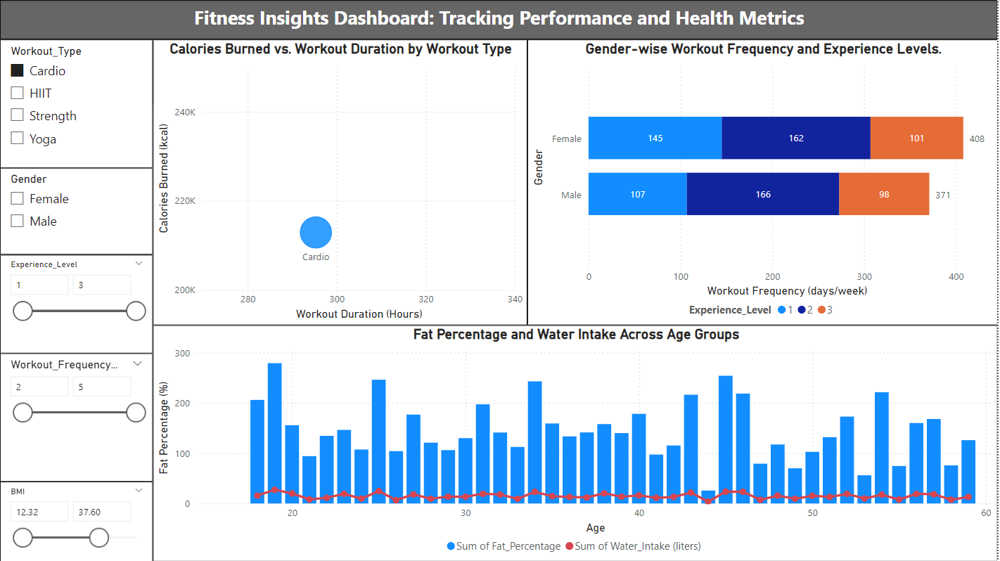
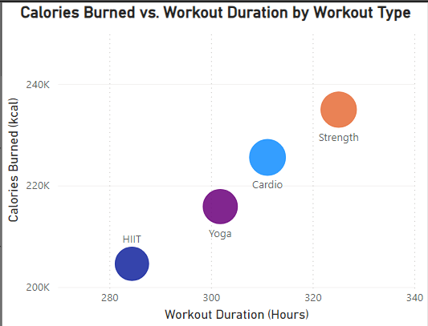
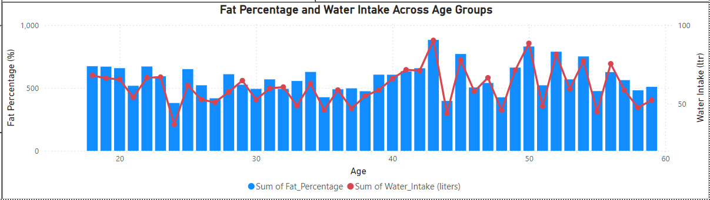

# Fitness-Insight-Dashboard

This interactive Power BI dashboard provides detailed insights into workout performance, health metrics, and trends across demographics. It enables fitness enthusiasts and professionals to make data-driven decisions to enhance health and performance.

---

## 📊 Dashboard Overview

---

## 🎚️ Dynamic Slicers

Filter insights based on workout type, gender, age group, and experience level for personalized analysis.

---

## 🚀 Features

- **Calories Burned vs. Workout Duration by Workout Type**  
  A scatter plot showing the relationship between calories burned and workout duration categorized by workout type.  
  

- **Gender-wise Workout Frequency and Experience Levels**  
  A bar chart comparing workout frequency across genders and experience levels.  
  

- **Fat Percentage and Water Intake Across Age Groups**  
  A line chart visualizing the correlation between fat percentage and water intake by age group.  
  

---

## 🛠️ Tools Used

- **Power BI**: To design interactive and dynamic dashboards
- **Data Processing**: Cleaned and transformed health and fitness data for accurate analysis

---

## 💡 Key Insights

- Strength workouts burn the most calories during longer sessions, while HIIT maximizes calorie burn in shorter durations.
- Workout frequency and experience levels vary significantly between genders.
- Higher water intake is associated with better fat percentage management in most age groups.

---

